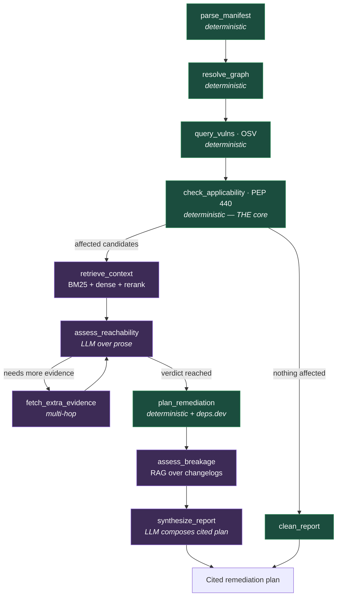

# Warrant

**Reachability-aware dependency remediation.** Point it at a Python project's lockfile and it produces a short, ranked, *cited* remediation plan: which dependencies are vulnerable (including transitively), whether each vulnerability is **actually reachable** given how your code uses the package, the **minimal safe upgrade**, and **what that upgrade might break**.


> The name comes from argumentation theory: an argument is **data → warrant → claim**, where the *warrant* is the justification that licenses the conclusion. Every verdict Warrant produces is a claim backed by an explicit, cited warrant — deterministic version math or retrieved advisory text — never an unsupported model guess.

---

## Table of contents

- [The problem](#the-problem)
- [What Warrant is (and is not)](#what-warrant-is-and-is-not)
- [The three things that make it different](#the-three-things-that-make-it-different)
- [Quick example](#quick-example)
- [The architectural rule](#the-architectural-rule)
- [Architecture](#architecture)
- [How it works, step by step](#how-it-works-step-by-step)
- [Data sources](#data-sources)
- [Evaluation](#evaluation-the-heart-of-the-project)
- [Installation](#installation)
- [Usage](#usage)
- [Project structure](#project-structure)
- [Roadmap](#roadmap)
- [Design decisions / FAQ](#design-decisions--faq)
- [Contributing](#contributing)
- [License](#license)

---

## The problem

You run a security scanner on a real project and get:

```
⚠️  47 vulnerabilities found
```

That number is almost useless on its own. It doesn't tell you:

- **Which of the 47 can actually hurt you.** Most vulnerable code paths are never reached by your code.
- **What to upgrade to** — the *smallest* safe bump, not "jump to latest and pray."
- **What will break** if you upgrade.
- **How to even fix** the ones buried in transitive dependencies you never chose to install.

The rational response to 47 vague, unprioritized alerts is to do nothing. The scanner "worked" and left everyone less safe, because it produced **noise instead of a decision**.

**Warrant turns that wall of alerts into a short, ranked, actionable plan — and shows its work for every claim.**

---

## What Warrant is (and is not)

**It is** a *triage-and-remediation advisor*: it reads the scanner's raw findings the way an expert would and hands you the few that matter, what to do, and what it will cost.

**It is not** a "chat with my PDFs" RAG demo, and it is **not** a reimplementation of Dependabot / `osv-scanner`. Plenty of tools *find* vulnerabilities. Warrant reasons about which found vulnerabilities *deserve your attention*.

---

## The three things that make it different

### 1. Reachability — "flagged, but does it actually matter?"

An advisory's affected range says a package is affected. The advisory *prose* often adds the real condition — "only exploitable if you call `X`" or "only with config `Y`." Warrant retrieves that prose and reasons about it against how you actually use the package.

> `PyYAML` is flagged CRITICAL. The bug is in `yaml.load()` on untrusted input. Your code only ever calls `yaml.safe_load()`. **Not exploitable in your app** — here's the advisory so you can verify.

Warrant reports **confidence honestly**: "the advisory says `X` is required; I found a call to `X` in your code" — never a false claim of certainty.

### 2. Cited breaking-change assessment — "what will the fix cost me?"

OSV gives the fixed version but says nothing about breakage. Warrant reads changelogs and migration guides between your current and target version and tells you what breaks — with citations — and finds the **minimal** safe upgrade instead of shoving you to the latest release.

> Upgrading `SomeLib 2.4 → 3.0` crosses a major version: `client.fetch()` was renamed to `client.get()` (you call it in 4 files). **Alternatively, `2.4.9` patches the same vuln with zero breaking changes** — take that instead.

### 3. A rigorous evaluation harness

Every quality claim is backed by a measured eval with **hard negatives** — close-name packages, off-by-one version boundaries, transitive-only cases — that reconcile conflicting sources. The headline artifact is a **before/after table** showing metrics climb as each component is added. See [Evaluation](#evaluation-the-heart-of-the-project).

---

## Quick example

Point Warrant at a lockfile:

```bash
warrant scan ./path/to/poetry.lock
```

Instead of "47 vulnerabilities," you get a ranked, cited plan:

```
Warrant — remediation plan for poetry.lock
312 packages scanned · 5 with known advisories · 3 need your attention

────────────────────────────────────────────────────────────────────────
🔴  Pillow 9.2.0  →  upgrade to 9.3.0          REACHABLE · do this first
    Why:   GHSA-xxxx is triggered via Image.open() on attacker-controlled
           input. You call Image.open() in upload_handler.py:42.
    Fix:   9.3.0 is the minimal safe version. Changelog shows a bug fix
           only — no API changes. Drop-in safe.
    Cite:  OSV: GHSA-xxxx · CVE-2022-xxxxx  |  Pillow CHANGES 9.3.0

────────────────────────────────────────────────────────────────────────
🟡  urllib3 1.26.5  →  upgrade to 1.26.18      VULNERABLE · low urgency
    Why:   Flaw only triggers with a proxy + redirect config you don't use.
    Fix:   1.26.18 is drop-in safe.
    Cite:  OSV: GHSA-yyyy  |  urllib3 CHANGES 1.26.18

────────────────────────────────────────────────────────────────────────
⚪  PyYAML 5.3  (transitive, via data-toolkit)  NOT REACHABLE · no action
    Why:   Vuln is in yaml.load() on untrusted input; data-toolkit only
           calls yaml.safe_load(). Not exploitable in this dependency's use.
    Cite:  OSV: GHSA-zzzz

────────────────────────────────────────────────────────────────────────
The other 44 findings: already patched or in unreachable paths. (--verbose)
```

That is a plan you act on before lunch, instead of a list you avoid for six months.

---

## The architectural rule

> **Version-range math is deterministic. The LLM never decides whether a version is affected.**

OSV gives affected ranges as structured data (e.g. `>=1.2.0 <1.4.5`). Answering *"is `1.4.5` affected?"* is a **resolver problem** governed by exact rules ([PEP 440](https://peps.python.org/pep-0440/) for PyPI), not a language problem. LLMs fail on exactly this shape — inclusive/exclusive boundary confusion, off-by-one — and fail *confidently*, which in security means false alarms or missed live vulnerabilities.

So Warrant removes that job from the model entirely and hands it to a real version-constraint library. The LLM is only trusted with the two genuinely fuzzy, prose-based jobs:

| Job | Nature | Who does it |
| --- | --- | --- |
| Is version `X` in affected range `R`? | Exact rules | **Deterministic resolver** |
| Which packages, which transitive tree? | Structured data | **Deterministic parsers / APIs** |
| Minimal safe version from `fixed` events? | Structured data | **Deterministic** |
| Is the vulnerability *reachable* here? | Fuzzy prose | **RAG + LLM** |
| What breaks on this upgrade? | Fuzzy prose | **RAG + LLM** |

**Structured facts → deterministic code. Ambiguous prose → RAG + LLM.** The two halves are physically separated in the codebase and measured on separate eval tracks, because they fail for different reasons.

---

## Architecture

Warrant is a **[LangGraph](https://langchain-ai.github.io/langgraph/) state machine**, not a linear chain. The conditional branches — short-circuiting to a clean report, or fetching extra evidence when reachability is uncertain — are the reason a graph framework is justified.

### The agent graph



Green = deterministic (facts). Purple = RAG/LLM (fuzzy judgment).

### The two-halves separation

The single most important structural property: the deterministic core and the fuzzy RAG layer are **separate packages that meet in exactly one place** (`agent/nodes.py`). You can read, test, and change either half without touching the other.

```
                 ┌──────────────────────────────────────────────┐
   lockfile ──▶  │                  agent/                       │  ──▶ cited plan
                 │   state.py  ·  nodes.py  ·  graph.py          │
                 │        (LangGraph orchestration only)         │
                 └───────────────┬───────────────┬──────────────┘
                                 │               │
              ┌──────────────────▼───┐     ┌─────▼─────────────────────┐
              │   core/  (FACTS)     │     │   rag/  (JUDGMENT)         │
              │  deterministic       │     │  retrieval + LLM           │
              │                      │     │                           │
              │  parse.py            │     │  corpus.py                │
              │  resolve.py          │     │  index.py  (BM25 + dense) │
              │  osv.py              │     │  retrieve.py (+ rerank)   │
              │  depsdev.py          │     │  reachability.py  (LLM)   │
              │  version_match.py ◀──┼─────┼─ breakage.py      (LLM)   │
              │   (PEP 440 — the     │     │                           │
              │    deterministic     │     │   uses llm.py wrapper     │
              │    heart)            │     │                           │
              └──────────────────────┘     └───────────────────────────┘
                 NO llm import ever            all model calls funnel
                                               through one llm.py
```

### Node reference

| # | Node | Kind | Input → Output |
| --- | --- | --- | --- |
| 1 | `parse_manifest` | Deterministic | lockfile → `[(ecosystem, name, version)]` |
| 2 | `resolve_graph` | Deterministic | packages → transitive graph (lockfile, or deps.dev when no lock) |
| 3 | `query_vulns` | Deterministic | graph → OSV candidates (with CVE/GHSA aliases) |
| 4 | `check_applicability` | Deterministic | candidates → **truly affected** subset (PEP 440 range math) |
| — | *conditional edge* | — | nothing affected → `clean_report`; else continue |
| 5 | `retrieve_context` | RAG | affected pkgs → ranked advisory/changelog chunks (BM25 + dense + rerank) |
| 6 | `assess_reachability` | LLM | chunks + code usage → reachable / not-reachable / uncertain **+ confidence** |
| — | *conditional edge* | — | uncertain → `fetch_extra_evidence` (multi-hop), then re-assess |
| 7 | `plan_remediation` | Deterministic | vuln → minimal safe version (OSV `fixed`), cross-checked via deps.dev |
| 8 | `assess_breakage` | RAG | current→target changelogs → grounded breakage assessment |
| 9 | `synthesize_report` | LLM | everything → final cited remediation plan |

### The shared state

Every node reads and writes one typed object that flows through the graph (designed before any node — it's the contract):

```python
class WarrantState(TypedDict):
    lockfile_path: str
    packages: list[Package]              # (ecosystem, name, version), SELF/DIRECT/INDIRECT
    dependency_graph: DependencyGraph
    candidates: list[VulnCandidate]      # OSV hits, with aliases + affected ranges
    affected: list[AffectedFinding]      # survived deterministic PEP 440 matching
    retrieved: dict[str, list[Chunk]]    # advisory/changelog evidence per finding
    reachability: dict[str, Reachability] # verdict + confidence + cited evidence
    remediation: dict[str, Remediation]  # minimal safe version + deps.dev cross-check
    breakage: dict[str, BreakageReport]  # grounded breaking-change assessment
    report: RemediationPlan | None       # final cited output
```

---

## How it works, step by step

1. **Parse** the lockfile into exact `(ecosystem, name, version)` triples, including the full transitive tree.
2. **Resolve** the dependency graph — straight from the lockfile when present, or via **deps.dev** when you only have a manifest.
3. **Query OSV** in batch for every node; collect candidates with their CVE ↔ GHSA ↔ OSV aliases.
4. **Match versions deterministically** with PEP 440. Candidates whose installed version falls *outside* the affected range are discarded here — no LLM involved.
5. **Short-circuit** to a clean report if nothing survives.
6. **Retrieve** advisory + changelog prose for the survivors using hybrid BM25 + dense retrieval, then rerank.
7. **Assess reachability** — the LLM reasons over the retrieved conditions against your code usage, and reports a verdict *with confidence*. If evidence is thin, a conditional edge fetches more (multi-hop).
8. **Plan remediation** — compute the minimal fixed version from OSV `fixed` events, and confirm via deps.dev that the bump actually pulls the fixed transitive version.
9. **Assess breakage** — RAG over changelogs between current and target.
10. **Synthesize** the final, ranked, cited plan.

---

## Data sources

| Source | Role | Notes |
| --- | --- | --- |
| **[OSV.dev](https://google.github.io/osv.dev/)** | Ground-truth vulnerability backbone | `POST /v1/query` (single) and `/v1/querybatch`. Aliases CVE ↔ GHSA ↔ OSV for free. **Does not support version-range queries** — query an exact version or parse `affected.ranges` yourself. **An empty response means "no record found," NOT "safe."** |
| **[deps.dev](https://docs.deps.dev/api/v3/)** | Transitive dependency resolution without installing | Used only when we have a manifest but no lockfile (a lockfile already contains the resolved tree). Nodes tagged `SELF` / `DIRECT` / `INDIRECT`. |

**Why not just trust NVD?** The US National Vulnerability Database has run an analysis backlog since early 2024 and hasn't fully recovered, so relying on it alone is unreliable *today*. Reconciling across OSV/GHSA is a deliberate, defensible design choice.

---

## Evaluation (the heart of the project)

The eval harness is built **before** any component is improved. A deliberately naive baseline is measured first; each added component must **earn its place by moving a number**. Three separate tracks:

| Track | Question | Ground truth | Metrics |
| --- | --- | --- | --- |
| **1 — Retrieval** | Does RAG pull the right documents? | 50–150 labeled `query → gold chunk` pairs (inferable from OSV aliases) | recall@5, MRR, nDCG |
| **2 — Classification** | Does the pipeline get the verdict right? | Free from OSV; loaded with **hard negatives** | precision, recall, F1 |
| **3 — Remediation quality** | Is the final plan good? | LLM-as-judge on a rubric + small human gold set | rubric pass rate |

**Hard negatives** (Track 2) are chosen to prove specific components earn their keep:
- **Close-name packages** (`requests` vs `requests-oauthlib`) — embeddings blur them; justifies BM25.
- **One patch above the fixed boundary** — the off-by-one trap; justifies the deterministic resolver.
- **Transitive-only** cases where the direct dependency looks clean; justifies the graph work.

**The killer artifact** — the naive baseline that asks the LLM directly *"is `1.4.5` affected by `>=1.2.0 <1.4.5`?"* getting boundary cases wrong a meaningful fraction of the time, then the deterministic resolver at ~100%, with RAG lifting reachability accuracy:

| Component added | Boundary acc. | Retrieval MRR | Reachability acc. | F1 |
| --- | --- | --- | --- | --- |
| Baseline (LLM version check + plain vector RAG) | 1.000 | **0.885** | _tbd_ | **0.360** |
| + Deterministic PEP 440 resolver | 1.000 | — | — | **1.000** |
| + Full fact layer (OSV + transitive graph) | — | — | — | _tbd_ |
| + Hybrid retrieval + rerank | — | _tbd_ | _tbd_ | _tbd_ |
| + Reachability reasoning | — | — | _tbd_ | _tbd_ |

*(Numbers filled in as each phase lands — see the [Roadmap](#roadmap).)*

> **On the version-math result (Phase 1):** the naive baseline, which asks the LLM to decide affectedness, scores **F1 0.360** — it systematically *under-flags*, missing 7 of 8 genuinely-affected packages (recall 0.500). The deterministic PEP 440 resolver scores **F1 1.000**. Note that *boundary accuracy is 1.000 for both*: the LLM "passes" the exact-fixed-version cases only because it defaults toward "not-affected", so a metric that rewards saying-safe is gamed by its own failure — F1/recall is what reveals it. In security, silently missing real vulnerabilities is the worst outcome, and it is exactly what removing the LLM from version math eliminates. Single run, temperature 0; reproduce with `uv run python -m evals.track2_classification [naive]`.

> **On the retrieval metric:** the column tracks **MRR** rather than recall@5, because on the current bounded corpus recall@5 saturates at 1.000 (the gold chunk is almost always somewhere in the top 5) and can't show improvement. MRR is rank-sensitive: the naive dense baseline scores **0.885** because it confuses a package's *advisory* with its *changelog* (near-identical wording), landing the gold chunk at rank 2 for several queries — exactly the weakness the Phase 3 hybrid BM25 pass targets. Baseline recall@1 is 0.769. Reproduce with `uv run python -m evals.track1_retrieval`.

---

## Installation

> ⚠️ Warrant is in active development; the CLI is not yet published.

```bash
git clone https://github.com/<your-username>/warrant.git
cd warrant
uv sync                       # create the environment and install deps
cp .env.example .env          # add your ANTHROPIC_API_KEY
```

**Requirements:** Python 3.11+. A hosted LLM API key (reasoning/judge nodes). Embeddings run locally (no key needed).

---

## Usage

```bash
# Scan a lockfile and print a remediation plan
warrant scan ./poetry.lock

# Show all findings, including the safe/unreachable ones
warrant scan ./poetry.lock --verbose

# Emit machine-readable output
warrant scan ./poetry.lock --format json

# Run the evaluation harness and render the before/after table
warrant eval --track all
```

---

## Project structure

```
warrant/
├── pyproject.toml
├── README.md
├── LICENSE
├── .env.example
├── src/warrant/
│   ├── core/            # DETERMINISTIC — no LLM is ever imported here
│   │   ├── parse.py             # lockfile/manifest → packages
│   │   ├── resolve.py           # transitive graph (lockfile or deps.dev)
│   │   ├── osv.py               # OSV client (query, batch, aliases, empty≠safe)
│   │   ├── depsdev.py           # deps.dev client
│   │   └── version_match.py     # PEP 440 range math — the deterministic heart
│   ├── rag/             # FUZZY — retrieval + LLM reasoning over prose
│   │   ├── corpus.py            # advisory/changelog ingestion + chunking
│   │   ├── index.py             # BM25 + dense index build
│   │   ├── retrieve.py          # hybrid retrieve + rerank
│   │   ├── reachability.py      # LLM judges reachability from conditions
│   │   └── breakage.py          # LLM reads changelogs current→target
│   ├── agent/           # LangGraph orchestration (the halves meet here)
│   │   ├── state.py             # the shared TypedDict
│   │   ├── nodes.py
│   │   └── graph.py
│   ├── llm.py           # single hosted-LLM wrapper (trace/cost chokepoint)
│   └── report.py        # cited-report model + rendering
├── evals/
│   ├── datasets/        # gold sets (retrieval / classification / remediation)
│   ├── track1_retrieval.py
│   ├── track2_classification.py
│   ├── track3_remediation.py
│   └── report.py        # renders the before/after table
├── corpus/              # curated, bounded advisory + changelog text
├── fixtures/            # sample lockfiles / test repos
├── docs/superpowers/specs/
└── tests/               # unit tests for the deterministic core
```

---

## Roadmap

Each phase ends by re-measuring and adding a row to the before/after table.

- [x] **Phase 0** — Baseline + eval harness (Tracks 1 & 2); deliberately naive version check + plain vector RAG.
- [x] **Phase 1** — Deterministic PEP 440 resolver. *(The killer artifact.)* Baseline F1 0.360 → 1.000.
- [ ] **Phase 2** — Full fact layer: OSV client + transitive graph + deps.dev fallback.
- [ ] **Phase 3** — Hybrid retrieval (BM25 + dense) + reranking.
- [ ] **Phase 4** — Reachability reasoning (headline feature) + clean-report short-circuit.
- [ ] **Phase 5** — Remediation + breakage assessment; Track 3 eval.
- [ ] **Phase 6** — Multi-hop evidence fetch *(only if the eval shows it's needed)*.
- [ ] **Phase 7** — Deployment: FastAPI, Docker, caching, tracing, CI eval gate.

---

## Design decisions / FAQ

**How is this different from Dependabot / `osv-scanner`?**
Those *find* vulnerabilities. Warrant reasons about **reachability** (flagged but not exploitable, given your usage), gives a **cited breaking-change assessment** for the upgrade, and is backed by a **rigorous eval harness with hard negatives**.

**Why is the version math not done by the LLM?**
Because "is `X` in range `R`?" has one correct answer under PEP 440's exact rules, and LLMs make confident off-by-one boundary errors. Determinism here is a correctness requirement, not a preference. See [The architectural rule](#the-architectural-rule).

**Why LangGraph and not a plain script?**
The conditional branches — short-circuiting when nothing is affected, and fetching more evidence when reachability is uncertain — are real control flow. A linear chain wouldn't need a graph; this does.

**Why one ecosystem (PyPI) only?**
Depth on a small surface beats breadth. Supporting several ecosystems would multiply the parser/resolver/corpus work without strengthening any of the three core stories.

---

## Contributing

Issues and pull requests are welcome. The one rule that must never be violated: **the deterministic core (`src/warrant/core/`) must never import or call an LLM.** Version-range decisions stay deterministic.

---

## License

[MIT](LICENSE) © 2026 Badis Bouali
